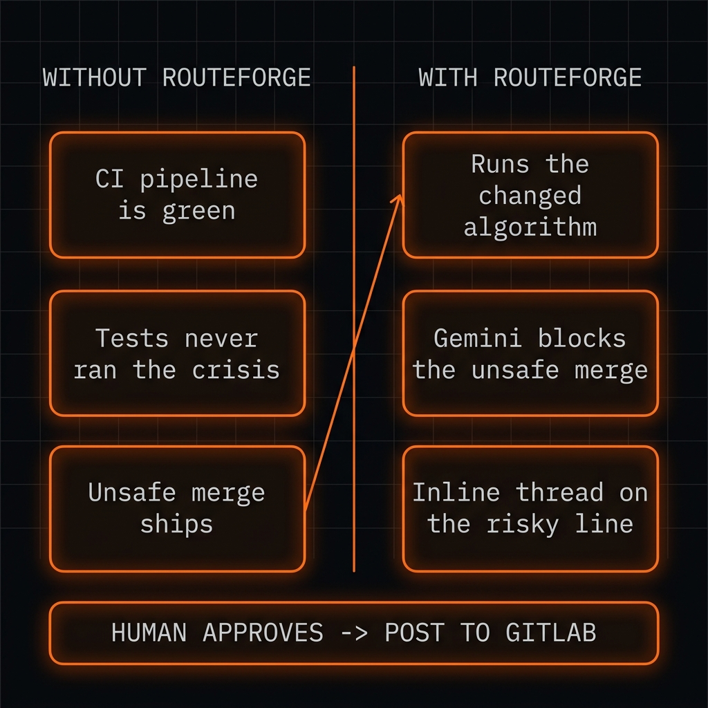
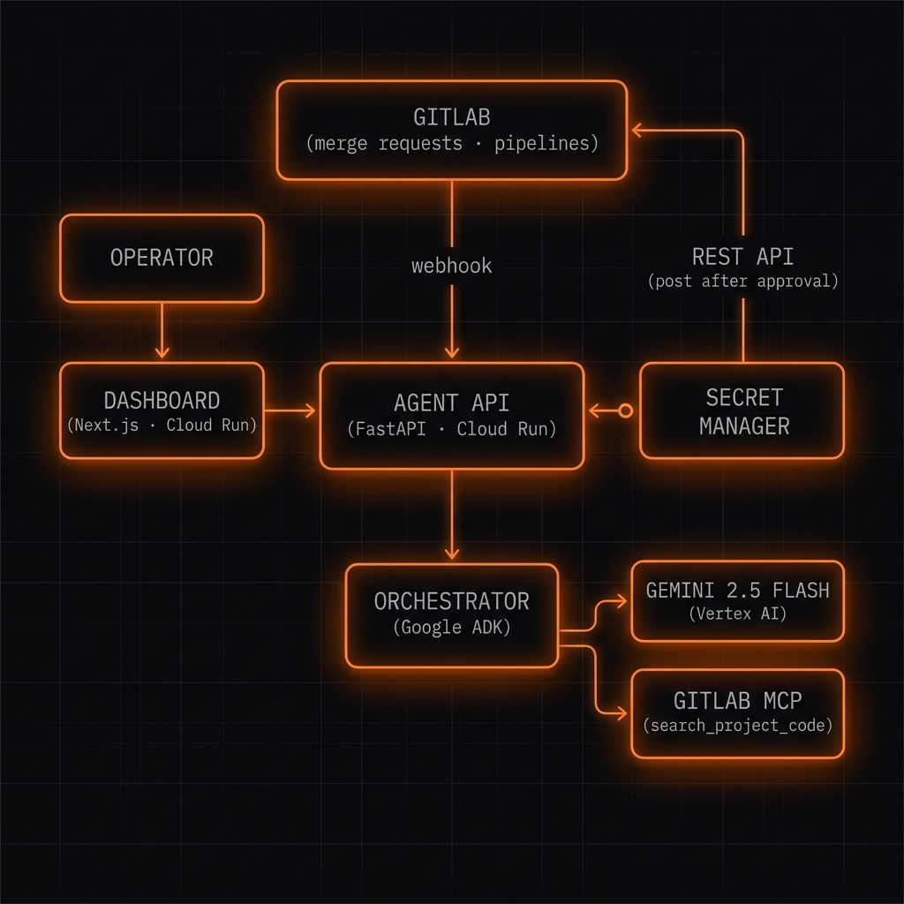
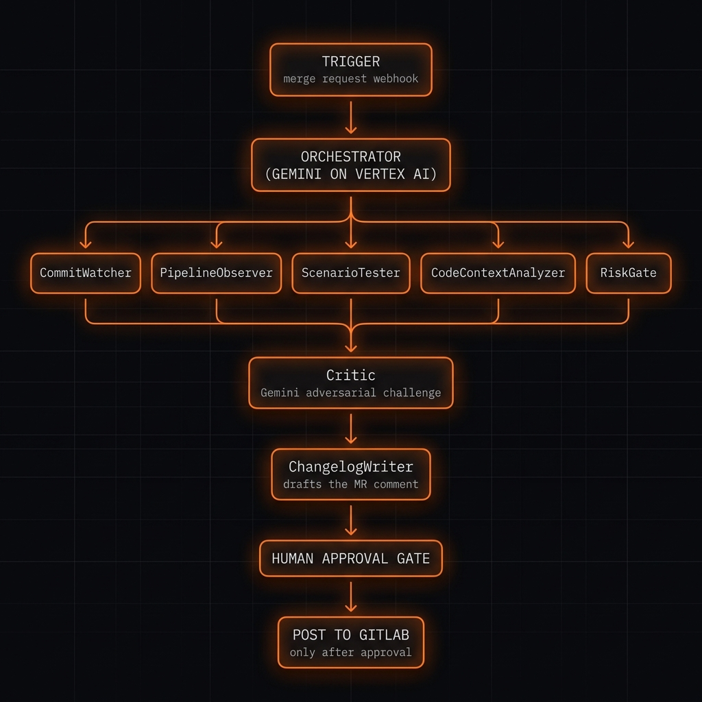
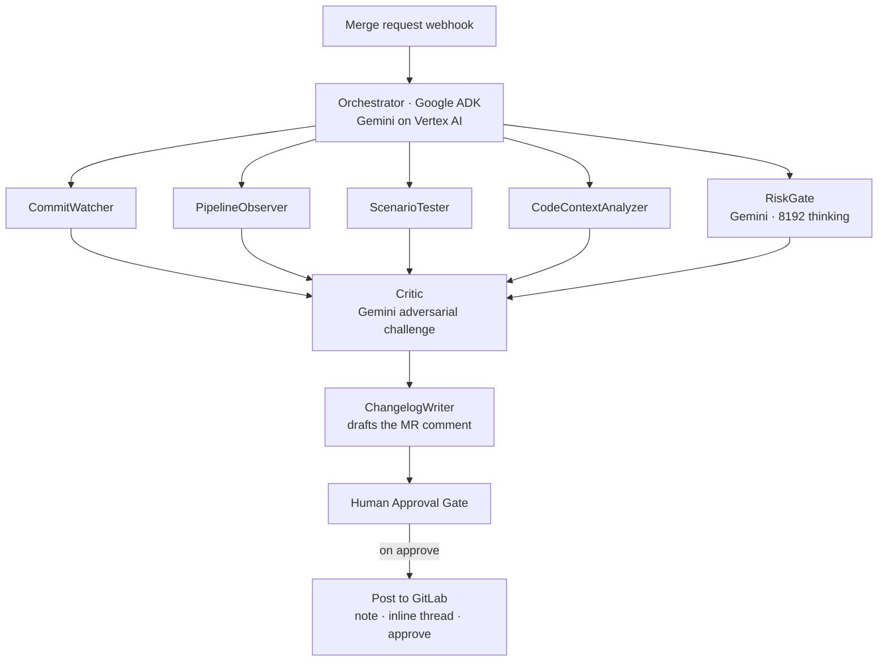
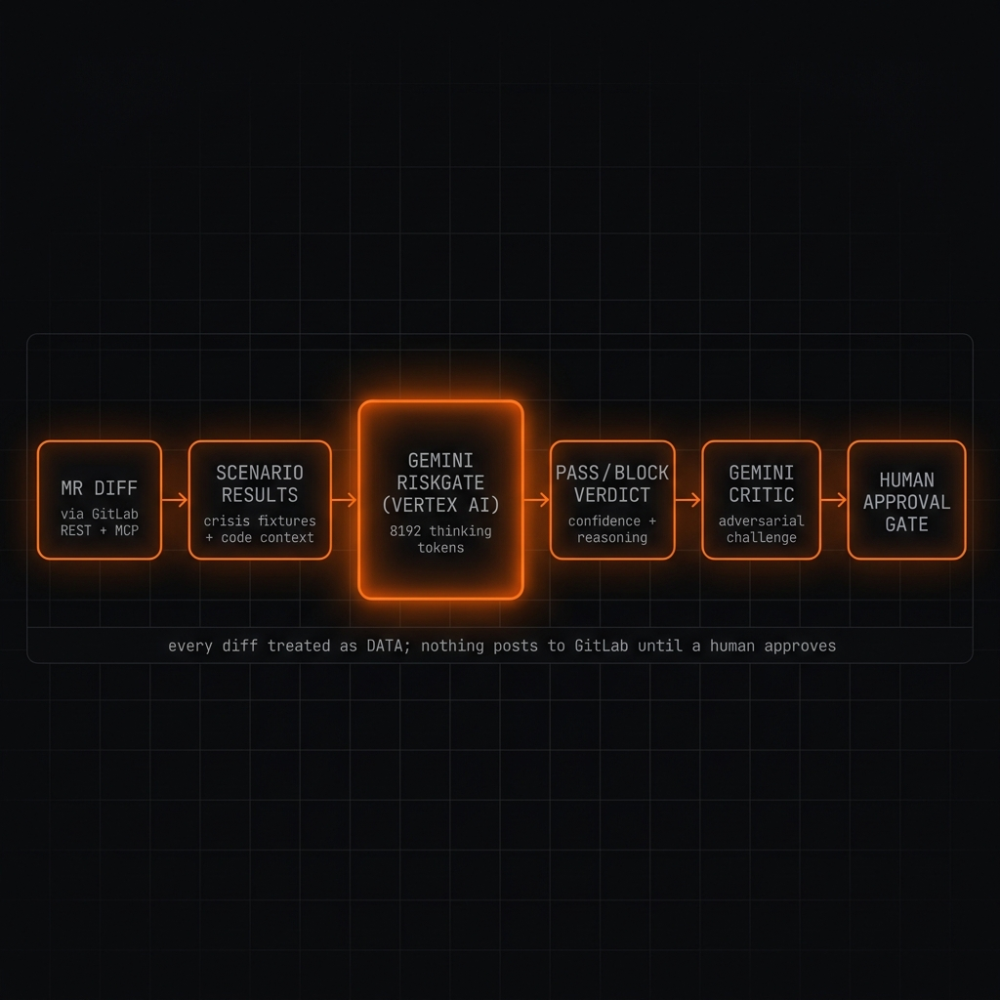

<!--
  RouteForge — Devpost "Project details" / "About the project"
  Paste the body below into Devpost. Upload the 4 PNGs in this folder to Project Media.
  Devpost does NOT render Mermaid — for the Devpost paste, drop the ```mermaid block
  (the uploaded PNGs cover it). On GitHub, both the PNGs and the Mermaid render.
-->

> **RouteForge is demonstrated on maritime routing, but it works for any high-stakes algorithm change** — fraud rules, claims logic, pricing engines, dosage calculators, grid controllers.

## Inspiration

Your team ships a performance improvement to your most critical algorithm — `+12% throughput`. Tests pass, CI is green, the diff is clean refactoring, reviewers approve. Buried in those 300 lines, one guard clause quietly disappears. The test suite never fed in the crisis case, so the metric improved and the **safety invariant silently vanished**. Three weeks later an attacker scripts exactly that case, your engine — which no longer knows about it — approves the whole run, and the post-mortem traces it to a one-line deletion in a "performance" MR everyone signed off on.

"The tests passed" is not "this is safe." Tests verify your code *runs*; they can't verify your algorithm still makes the right call in the one crisis it's never seen — the day that actually matters. We built the gate that does.



## What it does

RouteForge is an AI safety gate that runs at **code-review time**. It plugs into GitLab, intercepts every merge request, replays the *changed* algorithm against the crisis scenarios that matter for your domain, and asks **Gemini** the question your CI never does: *is this still safe?*

It returns a structured **PASS / BLOCK** verdict with a confidence score and visible reasoning, pins an **inline thread on the exact removed line**, and — critically — **posts nothing to GitLab until a human approves**. When the developer fixes the code and comments `@routeforge rescan`, the pipeline re-runs, the verdict flips to PASS, and the inline thread auto-resolves.

## How we built it

Eight pipeline steps on **Google ADK**, on **Cloud Run**, with **Gemini on Vertex AI** doing the reasoning.

**System architecture — GitLab as an operating surface, three channels:**



**The pipeline** — `CommitWatcher → PipelineObserver → ScenarioTester → CodeContextAnalyzer → RiskGate (Gemini) → Critic (Gemini) → ChangelogWriter`, gated by a human:





**Gemini is the brain** — the diff and scenario results become a typed PASS/BLOCK verdict with an 8192-token thinking budget, then a Gemini Critic adversarially challenges it:



RouteForge uses GitLab through **three channels**: a **webhook** (instant trigger on MR / note / pipeline events), the **MCP** (a self-hosted `zereight/gitlab-mcp` proxy — `search_project_code`, resolvable inline threads, work items, CI job logs), and the **REST API** (diffs, notes, scoped labels, formal MR approval).

**Stack:** Python · Google ADK · Gemini 2.5 Flash/Pro (Vertex AI) · GitLab (webhooks + MCP + REST) · `zereight/gitlab-mcp` proxy · FastAPI · Server-Sent Events · Next.js + Tailwind · Cloud Run · Secret Manager · Docker.

## Challenges we ran into

- **Catching a vanished invariant when CI is green.** The whole point is failures your tests *don't* cover, so we couldn't rely on the test suite — ScenarioTester replays the changed code path against a library of crisis fixtures and detects when a safety guard was removed, even though every test still passes.
- **Three GitLab channels, each pulling its weight.** The webhook is the only instant trigger; the MCP proxy exposes higher-level ops (semantic code search, resolvable inline threads, work items); REST handles diffs/notes/labels/approval. We run MCP through a self-hosted `zereight/gitlab-mcp` proxy so the tool surface is fixed and version-pinned.
- **Capturing Gemini's chain-of-thought, not just a token count.** RiskGate runs with an 8192-token thinking budget and `include_thoughts=True`; we extract the actual thought text and surface it in the dashboard alongside the Critic's challenge reasoning — the verdict is auditable, not a black box.
- **Hostile diffs.** A merge request from an external contributor is untrusted input. Every diff, title, and log line is labeled **DATA** in the prompt and structurally isolated; a regex pre-scan flags injection attempts, structured-output constrains the verdict to PASS/BLOCK, and the human approval gate is the real backstop.

## Accomplishments that we're proud of

- It catches the **unsafe merge your CI passes** — the safety guard that silently vanished.
- The verdict is a **live Gemini reasoning over the real diff** every time — no hardcoded numbers.
- **Visible chain-of-thought + an adversarial Critic** make every BLOCK explainable.
- A genuine **three-channel GitLab integration** with inline threads that auto-resolve on `@routeforge rescan`.
- **Nothing posts to GitLab until a human approves.**

## What we learned

- "The tests passed" and "this is safe" are different claims — you have to *replay the crisis the tests never simulated*.
- GitLab is an operating surface, not just a git host: webhook + MCP + REST together make an agent a first-class reviewer.
- Capturing the thinking *text* (not the token count) is what makes an AI verdict trustworthy.
- An adversarial Critic meaningfully cuts false positives — a false alarm wastes a developer's day.

## What's next for RouteForge

- Auto-generate domain scenarios from a repo's own history.
- One click: open the proposed fix as a merge request.
- Multi-repo / monorepo path-scoped gating.
- Deeper static analysis to localize the exact removed invariant automatically.

---

**Built with** (Devpost tag field): `python · google-adk · gemini · vertex-ai · gitlab · model-context-protocol · fastapi · server-sent-events · next.js · tailwindcss · google-cloud-run · secret-manager · docker`

**Try it out:**
- Live dashboard — https://routeforge-dashboard-336382452417.us-central1.run.app
- GitHub — https://github.com/shipsafe-ai/shipsafe-routeforge
- One command — `npx shipsafe-routeforge demo`
